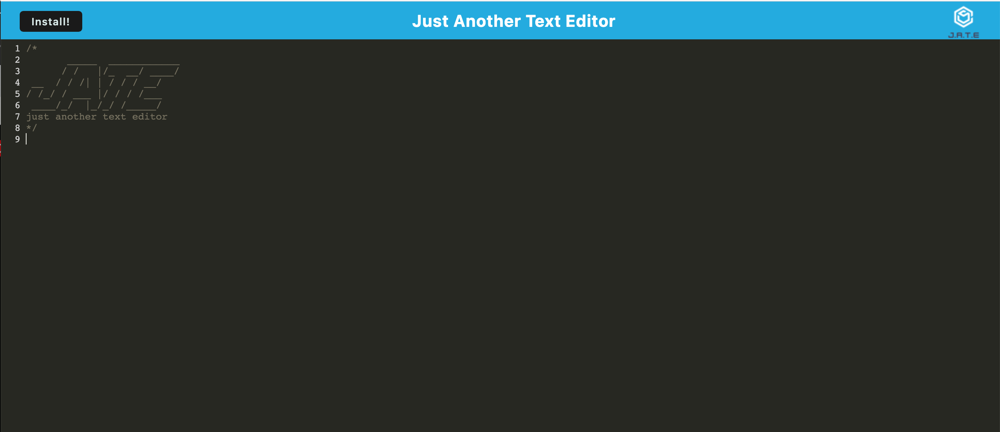
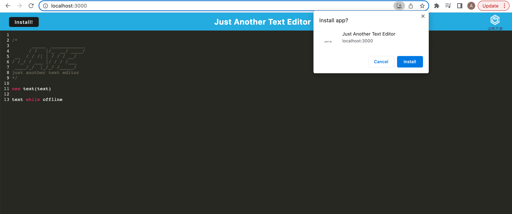
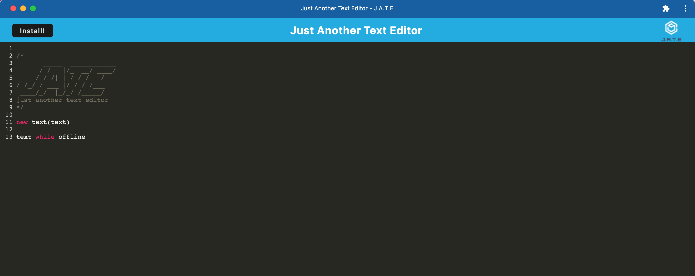

# Text Editor

## Description

This text editor is a simple single page that adds natural code styling. In addition, it provides a lot of offline functionality through PWA, indexedDB, and local storage. 

I created this project to practice the PWA skills that I learned in class. All of the data is stored in IndexedDB API so that it can be stored and retrived.

## Table of Contents

- [Installation](#installation)
- [Usage](#usage)
- [Credits](#credits)
- [License](#license)
- [Badges](#badges)

## Installation

1. Click on green code button and copy the ssh link
2. Open up terminal or git bash, then navigate to where you want the repository to be placed.
3. Type out "git clone (ssh link)"
4. Be sure to install Node.js. Node.js is necessary to run this program. If you need to, download it from the [Node.js website](https://nodejs.org/en/download/).
5. Once you have installed Node.js, navigate to inside the 'text-editor' folder
6. Run 'npm run install' to install packages within package.json

## Usage

To start this program on your local computer, navigate to your text-editor folder. Type 'npm run start' into your terminal. Once you see 'Now listening on port 3000' in your terminal, navigate to [http://localhost:3000](http://localhost:3000). You can also use [my website](https://just-another-text-editor-4-u.herokuapp.com/).

You will be greeted by the home screen.

You can add whatever text you want to it. The styling of any code will automatically be styled. It will even work offline.

If you want to download the application, you can press the install button. This will bring up a prompt. 

If install is pressed on the prompt, the application will be installed locally on your computer.

## Credits

IndexedDB get: https://developer.mozilla.org/en-US/docs/Web/API/IDBObjectStore/get 

IndexedDB put: https://developer.mozilla.org/en-US/docs/Web/API/IDBObjectStore/put

## License

Please refer to LICENSE in this repository

## Badges

